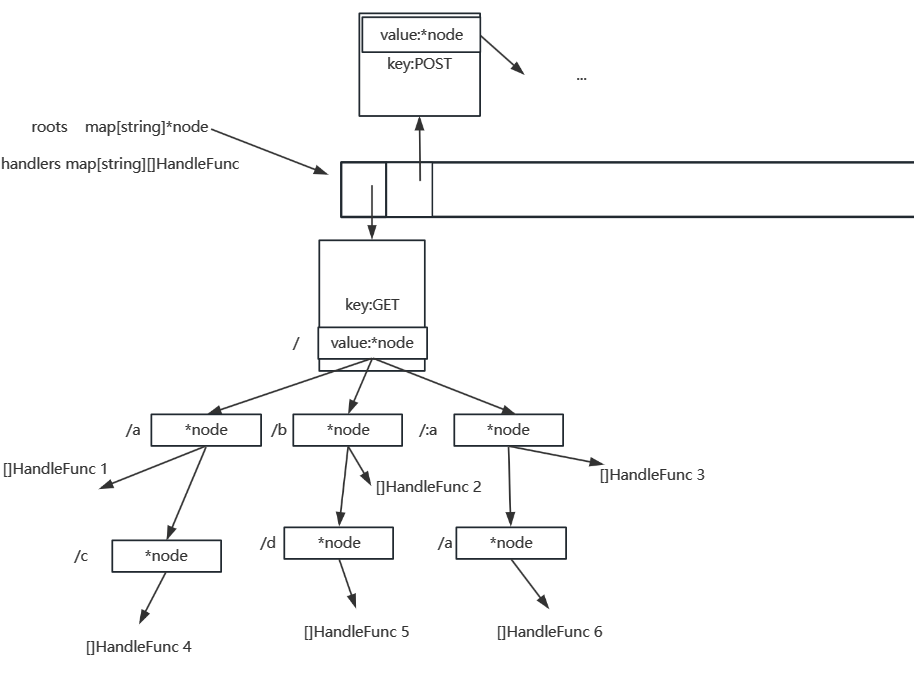

# 简介
根据net/http包编写一个简易的gin框架，改进gee的两个bug
# 路由结构图

# 项目包结构
* Gee 
  * gin
  * gee
  * main
1. gin:官方版本
2. gee:我实现的版本
3. main:gee入口
# 主要结构体
* engine:gee的默认引擎
```go 
type Engine struct {
    *RouterGroup
    router *router
    groups []*RouterGroup
}
  ```
* RouterGroup:gee的组
```go
type RouterGroup struct {
    prefix      string
    middlewares []HandleFunc // middleware
    parent      *RouterGroup
    engine      *Engine // 共享一个引擎
}
```
* Context:上下文，它是用户请求的核心
```go
type Context struct {
	Method     string
	Path       string
	Writer     http.ResponseWriter
	Request    *http.Request
	Params     map[string]string
	StatusCode int
	//用户请求要执行的函数链
	handlers []HandleFunc
	index    int    //执行的函数链下标
}

```
* router:roots用来存储gee不同方法对应的前缀树根节点，handlers，存储路由对应的函数链
```go
type router struct {
    roots    map[string]*node//键是GET、POST等，值是前缀树根节点
    handlers map[string][]HandleFunc//键是方法+路径请求路径，值是函数链，
}
```
* node:前缀树的节点
```go
type node struct {
    pattern  string  //待匹配路由 /p/:expl
    part     string  //路由中的一部分，如 :expl
    children []*node //子节点，
    isWild   bool    //是否精确匹配，part含有:、*为true
}
```
# 功能介绍
## gee引擎engine指针方法
* ServeHTTP,http.ListenAndServe是启动web服务的，需要传入一个参数，而只有实现ServeHTTP方法才能当做ListenAndServe参数来启动web服务。
* Run包装http.ListenAndServe,传入gee引擎，用来启动服务。
## gee的组RouterGroup的指针方法
* addRoute是添加路由的基础
* GET添加一个GET路由
* PUT添加一个PUT路由
* POST添加一个POST路由
* DELETE添加一个DELETE路由
* Group构造一个组
* Use在一个组中添加一组中间件，在Use后续的路由会受到新添加的中间件的影响
## 上下文context指针方法
* Param获取路径参数
* PostForm获取表单值
* Query获取查询参数
* Status设置请求状态码
* SetHeader设置响应头键值对
* String响应字符串给客户端
* JSON响应json给客户端
* HTML响应html页面给客户端
* Fail响应失败消息给客户端
* Next执行context指针存储的函数切片(函数链)
## router指针方法
* newRouter初始化一个路由
* parsePattern解析路由
* addRoute具体实现添加一个路由
* getRoute根据用户请求方法和路径获取对应结点
* handle执行用户请求对应的路由，通过getRoute获取路由对应的前缀树结点来实现
## 树的结点node指针方法
* matchChild查找符合条件的孩子结点，插入节点的时候使用
* matchChildren查找多个符合条件的孩子结点，搜索节点的时候使用
* insert根据解析的请求路径递归插入前缀树节点
* search根据请求路径递归搜索符合条件的前缀树节点
## 其他方法
* foo打印路由及映射的函数
* Logger打印接口的方法、访问路径、日期以及用时
* Recovery捕获panic的错误，并打印报错的具体行
* New返回一个初始化的gee引擎
* Default返回一个初始化并且添加了Logger和Recovery中间件的gee引擎